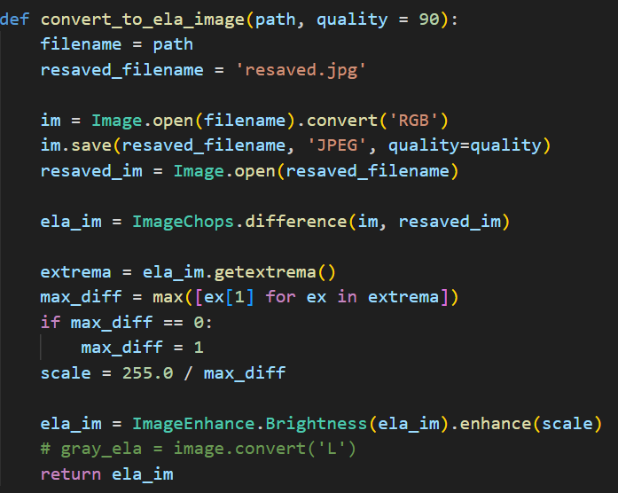
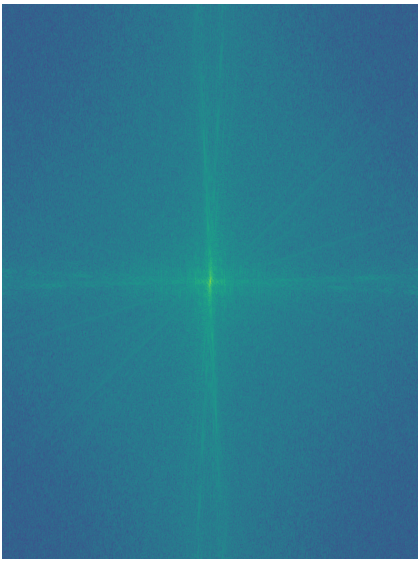

> **Image** **Detection**
>
> **BY:**
>
> Nikesh Gupta (2021B4A31509P)

**Abstract:**

In this project, we address the challenge of detecting edited images,
aggravated by the widespread availability of sophisticated image editing
tools. Our approach employs Error Level Analysis (ELA) and Convolutional
Neural Networks (CNNs) to identify manipulated images. ELA is used as a
preprocessing step to highlight regions with different compression
levels, enhancing the detection capabilities of our system. A CNN
architecture is then utilized, trained on these ELA-enhanced images to
classify them as authentic or edited. While our primary detection
methods are ELA and CNN, we also explored the potential integration of
additional techniques such as Frequency Analysis, Gradient Analysis, and
Image Reconstruction. However, these methods were not implemented but
considered for future enhancement of the model's accuracy and
robustness. The experimental results showcase the effectiveness of our
approach in detecting various types of image manipulations, and we
provide a comparative analysis with existing methods. This study
underscores the potential of our method as a valuable tool in combating
the dissemination of fraudulent visual content in digital media.

**Introduction** **and** **Significance:**

In the digital age, the authenticity of visual content has become a
significant concern due to the rapid advancement and accessibility of
image editing software. This proliferation has made it increasingly
difficult to distinguish between genuine and manipulated images, posing
serious challenges to the integrity of digital media. Recognizing the
urgency of this issue, our project develops and evaluates a robust
methodology for detecting edited images, an essential tool in
maintaining the credibility of digital content.

Our approach centers on the use of Error Level Analysis (ELA) combined
with Convolutional Neural Networks (CNNs). ELA serves as an effective
preprocessing technique that exploits variations in image compression to
highlight potential areas of manipulation. This analysis provides a
refined input for our CNN, which is specifically trained to discern
between altered and unaltered images based on these highlighted
discrepancies.

While the core of our detection system relies on ELA and CNN, we also
considered the feasibility of incorporating additional analytical
techniques such as Frequency Analysis, Gradient Analysis, and Image
Reconstruction. These methods were evaluated for their potential to
further enhance the detection capabilities of our system. Although they
were not implemented in the current phase of our research, they
represent promising avenues for future work to improve the model’s
accuracy and adaptability.

This report outlines the detailed methodology, experiments conducted,
and the results obtained from our study. By comparing our approach with
existing state-of-the-art methods, we demonstrate the effectiveness and
efficiency of our model in identifying and classifying edited images,
thereby contributing to the broader efforts to combat the spread of
misleading or fraudulent visual content.

**Initial** **Attempt** **and** **Problem** **Encountered:**

**Approach:**

Our initial approach to detecting edited images involved analyzing
sudden changes in the light direction vector. The premise was based on
the hypothesis that discrepancies in lighting could indicate potential
image manipulation, particularly in regions where edits might disrupt
the natural flow of light across the image. This method sought to
automatically detect unnatural variations in light direction that
typically occur during image splicing or other forms of digital
manipulation.

**Problem** **Faced:**

Despite the theoretical soundness of the approach, we encountered
significant challenges during practical implementation. The primary
issue was the complexity introduced by the presence of multiple light
sources in an image. Natural environments and many digitally created
scenes often contain a variety of light sources, each casting shadows
and highlights in different directions. This complexity makes it
difficult to determine a consistent baseline for what constitutes a
"natural" light direction vector across different images.

**Solution** **-** **Using** **ELA:**

**What** **is** **ELA?** **(Error** **Level** **Analysis):**

Error Level Analysis (ELA) is a forensic technique used in the field of
digital image analysis to detect manipulations or alterations. It is
based on the premise that when an image is compressed (for example, as a
JPEG), all parts of the image should compress at approximately the same
rate. However, if an image has been altered by adding, modifying, or
deleting elements, the manipulated sections may exhibit a different
compression level compared to the original sections. ELA exploits this
discrepancy to highlight areas of potential manipulation.

**Why** **ELA?:**

ELA helps highlight regions in an image that have been subjected to
different levels of compression. When an image is edited or manipulated,
these regions may have different compression levels compared to the rest
of the image.

**Real** **Image** **and** **its** **ELA**

**Edited** **Image** **and** **its** **ELA**

We can see in the edited image the blue and orange book is copied over
and a dinosaur is added and in the ELA these areas have really bright
spots with high varience.

**Steps** **for** **Solution:**

> 1\. **Preliminary** **Data** **Collection** **and** **Preparation:**
> Gather a comprehensive dataset of original and morphed images. This
> dataset should include a wide variety of manipulations to ensure the
> robustness of the model. Preprocess the images to a uniform size and
> format for analysis.
>
> **2.** **ELA** **Implementation:**
>
> a\. **Preprocessing:** Before applying ELA, each image in the dataset
> is preprocessed to ensure consistency. This involves resizing images
> to a standard dimension and converting them to a uniform format if
> necessary. Preprocessing is essential for the effective application of
> ELA, as it reduces variability unrelated to manipulation.
>
> b\. **Application** **of** **ELA:** ELA is applied to every image in
> the dataset. The process involves saving each image at a predefined,
> consistent compression level (typically as a JPEG) and then comparing
> this newly compressed version with the original image. The comparison
> highlights differences in compression levels, which manifest as
> variations in error levels.
>
> c\. **Generating** **the** **ELA** **Layer:** The outcome of the ELA
> process is a new image (or layer) for each original image, which
> visually represents the differences in error levels. Areas of the
> image that have been edited or manipulated and then resaved will
> typically show higher error levels, appearing as distinctly brighter
> or more colorful regions when visualized. This ELA layer serves as a
> map of potential manipulations within the image.
>
>
> d.
>
> Calculation of ELA of an Image:
>
> i\. Saving the image at 90% the original quality and taking the
> difference.
>
> ii\. Scaling of the image brightness as differences are really small.
> e. **CNN** **Model** **Design** **and** **Training:**
>
> i\. **Model** **Design:** Design a CNN architecture tailored to the
> task of morphed image detection. The model should include
> convolutional layers capable of extracting detailed features from both
> the original images and their ELA-processed counterparts.
>
> ii\. **Training:** Train the CNN on the prepared dataset, using a
> split of training, validation, and testing sets to evaluate
> performance and prevent overfitting. Employ augmentation techniques to
> increase the diversity of training data and improve model
> generalization.
>
> f\. **Integration** **and** **Testing:** Integrate the ELA and CNN
> components into a cohesive system. Test the system on a separate set
> of images not seen by the model during training to evaluate its
> real-world applicability.
>
> g\. **Evaluation** **and** **Optimization:** Use a range of metrics
> (e.g., accuracy, precision, recall) to evaluate the system's
> performance. Analyze misclassifications to identify any patterns or
> weaknesses in the model. Refine the model architecture and training
> process based on these insights.
>

**Solution** **Design:**

> **1.** **Dataset:** we have used the *CASIA* *2.0* *Image* *Tampering*
> *Detection* *Dataset*
> <u>(<https://www.kaggle.com/datasets/divg07/casia-20-image-tampering-detection-dataset/code></u>)
> for training our CNN Model.
>
> a\. It contains 7492: Real Images and 5123: edited Images.
>
> b\. Which were divided randomly into 80% Train and 20% Test. **2.**
> **Files** **Description:**
>
> a\. **elagenerator.py:** It has been used to generate the ela Images
> of the dataset and store them in the corresponding folder (either
> ‘Real’ or ‘Fake’). It also generates a new file, resaved.jpg which
> stores the resaved version of an image whose ela is being currently
> generated.
>
> b\. **model.py:** It trains the CNN model and stores the best model in
> the ‘Models’ folder which can be used to classify images later.
>
> c\. **loadModel.py:** It loads the ‘best_model.keras’ file from the
> Models folder and classifies the given Image as real or fake.
>
> d\. **Models** **folder:** stores the trained best model.
>
> e\. **Results** **folder:** has the Accuracy graph and Confusion
> matrix for the previous and final trained models with ‘Accuracy final’
> and ‘Confusion Matrix final’ being the submitted and used models
> accuracy graph and confusion matrix.
>
> f\. **sample** **folder:** It contains sample test images.
>
> **3.** **Generating** **ELA:**
>
> a\. An ela image is generated by resaving the image at 90% quality and
> taking the difference between the two images which captures the change
> in compression levels between the two images.
>
> b\. The ela image obtained is usually very dark as minimal difference
> between the original and resaved image. To enhance the image features
> we scale the image with max value of a pixel in the ela image being
> scaled to 255.
>
> c\. The **elagenerator.py** does this for all dataset images and
> stores in the corresponding folder.
>
> **4.** **Making** **the** **Model:** we have used these layers to
> build a strong model:
>
> a\. **Convolutional** **Layers** **(2** **layers):** Extract intricate
> patterns, such as edges and textures, from input images. Hierarchical
> feature extraction enhances the model's ability to discern between
> authentic and manipulated regions.
>
>
> b\. **Pooling** **Layer** **(1** **layer):** Down-sample feature maps,
> preserving essential information while reducing computational
> complexity. This operation enhances the model's efficiency and
> translational invariance.
>
> c\. **Dropout** **Layer** **(2** **layers):** Mitigate overfitting by
> randomly deactivating neurons during training. This regularization
> technique fosters model robustness and generalization across diverse
> datasets.
>
> d\. **Flatten** **Layer** **(1** **layer):** This layer transforms
> multidimensional feature maps into a one-dimensional array,
> facilitating seamless integration with densely connected layers. It
> prepares the extracted features for classification by reshaping them
> into a suitable format.
>
> e\. **Fully** **Connected** **Layers** **(2** **layers):** These
> layers integrate the extracted features from convolutional layers and
> make informed classification decisions. By capturing complex
> relationships between features, they enable the model to learn
> intricate decision boundaries and classify images accurately.
>
> f\. **Output** **Layer** **(1** **layer):** At the final stage, the
> output layer generates predictions based on learned features. It
> typically comprises neurons corresponding to the number of classes in
> the classification task and applies an appropriate activation function
> to produce probability distributions over the possible classes. This
> facilitates inference and decision-making, determining the
> authenticity of input images.

**Results:**

After training the Model we were able to achieve an accuracy of 92.11%
which can be seen in the Accuracy graph while training the model and the
confusion matrix calculated by running the best model for the test data
which is 20% of the data.

**Results** **for** **the** **sample** **test** **images:**

White: correct classification Red: wrong classification.

Yellow: very close probability of being wrong.

**Problems** **Identified:**

The images classified in the ELA-CNN Model are limited to the dataset
which contains only very bright and clean images. In real life photos
can vary with lighting, can be noisy or blurry and the model sometimes
fail to identify them or identifies them with low probability.

**Further** **Improvements** **Tried:**

To address the limitations encountered in our initial attempts, we
explored several advanced techniques aimed at improving the accuracy and
reliability of our edited image detection system. These methods were
investigated to determine their potential to supplement our primary
tools, ELA and CNN, by providing additional data points and analytical
perspectives.

**Image** **Reconstruction** **Using** **Projections:**

<u>Approach</u>: Image reconstruction from projections involves
generating a

two-dimensional image from a series of one-dimensional projections taken
from different angles. This technique, commonly used in medical imaging
and other fields, was adapted to assess whether it could help in
identifying inconsistencies typical of manipulated images.

<u>Challenges</u>: While theoretically promising, the application of
this method in detecting image manipulations proved complex. The main
challenge was differentiating between naturally occurring variations in
projections due to legitimate scene elements and those resulting from
manipulative editing.

**Frequency** **Analysis:**

<u>Approach</u>: We explored the use of frequency analysis to detect
edited images by examining the frequency components of an image. Edits
often introduce anomalies that can be detected as unusual patterns in
the frequency domain, not visible in the spatial domain.

Calculating the FFT of an Image.

> 1\. fft2 function: calculated the 2D fast fourier transform of the
> image. 2. ffshift function: shifts the FFT to the origin.

<u>Dual ELA-FFT model</u>: We calculated the FFT as well as the ELA of
the image and tried to make a Dual input CNN model the takes both ELA
and FFT of the image to classify if the Image has been edited or is
real.

**Gradient** **Analysis:**

<u>Approach</u>: Gradient analysis was used to calculate the direction
and magnitude of edges in images, providing insights into the natural
flow and disruptions typical in edited images. We further enhanced this
method by segmenting images into smaller regions, allowing for localized
analysis of gradient histograms.

> 1\. Calculated the Image’s first derivative across the x direction and
> y direction. 2. And used the derivatives to calculate the magnitude
> and direction.
>

**Image** **Gradient** **-** **Histogram** **of** **Real** **Image**

**Image** **Gradient** **-** **Histogram** **of** **Fake** **Image**

<u>Gradient Analysis with Segmentation:</u> we segmented the image of
size N\*M into c squared images of size (N/c)\*(M/c), and plotted the
same gradient histograms.

**Segmentation** **of** **Images** **-** **Real** **image** **-**
**Magnitude**

**Segmentation** **of** **Images** **-** **Real** **image** **-**
**Direction**

**Segmentation** **of** **Images** **-** **Fake** **image** **-**
**Magnitude**

**Segmentation** **of** **Images** **-** **Fake** **image** **-**
**Direction**

**Conclusion:**

Throughout this project, our primary goal was to develop a reliable
system for detecting edited images, a challenge exacerbated by the rapid
evolution of image editing technology. Utilizing Error Level Analysis
(ELA) and Convolutional Neural Networks (CNNs) formed the backbone of
our approach, yielding substantial initial success yielding an
impressive accuracy of 92.11%. However, recognizing the complexity of
image manipulation techniques and their diverse manifestations, we
endeavored to broaden our detection capabilities through the exploration
of several advanced methods such as Image reconstruction from
projections, Frequency analysis, Gradient Analysis with and without
segmentation.

The insights gained from these additional techniques suggest pathways
for future development. By continuing to refine these methods and fully
integrating them into our detection system, we can improve our ability
to combat the dissemination of fraudulent digital content.

In conclusion, the project has not only highlighted the effectiveness of
ELA and CNNs in detecting image manipulations but also underscored the
potential of integrating additional analytical tools to further enhance
detection capabilities. The continued evolution of our methods will be
crucial in keeping pace with the ever-advancing field of image editing
technologies.

**References:**

> 1\. Dr. Jayasri Kotti, Dr. E. Gouthami, Dr. K. Swapna, Suneetha
> Vesalapu \| MORPHED IMAGE DETECTION USING ELA AND CNN TECHNIQUES \|
> Journal of Pharmaceutical Negative Results \| Volume 13 \| Special
> Issue 7 \| 2022
>
> 2\.
> [<u>https://www.infosecinstitute.com/resources/digital-forensics/error-level-analysis-d</u>](https://www.infosecinstitute.com/resources/digital-forensics/error-level-analysis-detect-image-manipulation/)
> [<u>etect-image-manipulation/</u>](https://www.infosecinstitute.com/resources/digital-forensics/error-level-analysis-detect-image-manipulation/)
>
> 3\. Gonzalez, R. C. & R. E. Woods, Digital Image Processing, Pearson
> Education Asia.
>
